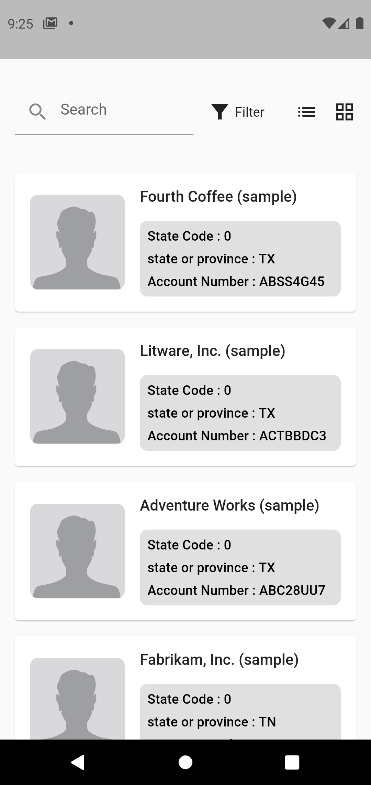

## Below there are a few instructions about mandatory commands to be run in order to facilitate the work.

## Linting

It's required as a part to pass all linting instructions so in order to check the issues before
pushing to the online repo.

```bash
flutter analyze
```

## Generate DI classes , retrofit with dio , mock classes

i'm using [Injectable](https://pub.dev/packages/injectable) to handle dependency injection through
the app and generate dependency classes.

i'm using [Retrofit](https://pub.dev/packages/retrofit) to handle APIs calls using Dio and generate
dependency classes.

i'm using [Mockito](https://pub.dev/packages/mockito) to generate Mocks for unit testing

```bash
flutter packages pub run build_runner build --delete-conflicting-outputs
```

## Build the docker image

Use docker build the container image

```bash
docker build -t rent_ready_web .
```

If you have some problem during cache, you can clean cache by this

```bash
docker build --no-cache -t rent_ready_web .
```

## After Success building image

Run the docker image with localhost 1200 port. You can change to any other port just replace it.

```bash
docker run -d -p 1200:80 --name rent_ready rent_ready_web
```

## for L10n Localization

i'm using [flutter_localizations] and [Intl](https://pub.dev/packages/intl) to handle arb strings
localization.

in order to use [Intl](https://pub.dev/packages/intl) you have to use to generate localizations
files

```bash
flutter pub get
```

that's why i added [generate: true] in pubspec.yaml to generate the localization files under
.dart_tool/flutter_gen you can find application strings files under [lib/l10n](lib/l10n)

## to run project unit test and widget test use

```bash
flutter test
```

## Project Architecture


## Project screenshots
<table>
  <tr>
    <td></td>
    <td></td>
  </tr>
<tr>
    <td></td>
    <td></td>
  </tr>
<tr>
    <td></td>
    <td></td>
</tr>
<tr>
    <td></td>
    <td></td>
  </tr>
<tr>
    <td></td>
    <td></td>

</tr>
 </table>